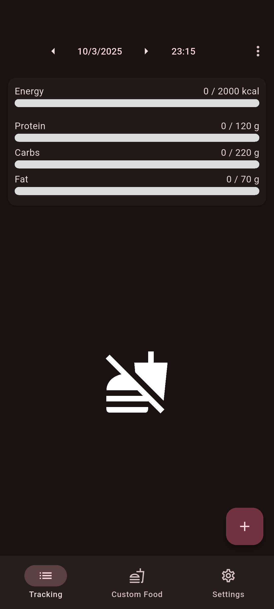
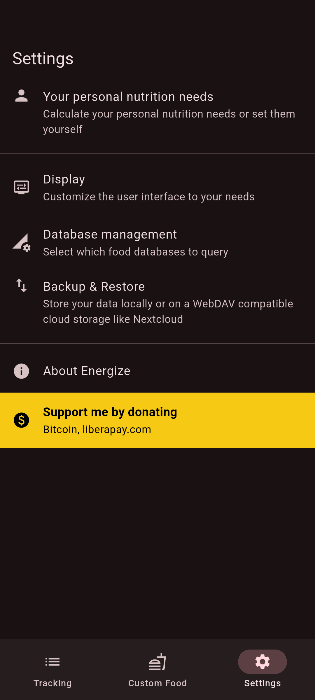

# Energize

Notice from 3. October, 2025:

> ⚠️ Your personal freedom to install Android apps from any store or source you like is in danger. Google plans to block installation of apps outside of the Play Store if the developer did not register with Google. For more information please see this [great blog post from F-Droid.org](https://f-droid.org/de/2025/09/29/google-developer-registration-decree.html).

    

  - Energize is respecting the user's privacy. [🔒 Privacy policy](PRIVACY.md)
  - Community-moderated [[Matrix] room](https://matrix.to/#/%23energize:matrix.org)

  
  
  
  

  <small>For the Codeberg Pages build, please see <a href="https://codeberg.org/epinez/Energize/src/branch/main/BUILD.md#known-limitations"> known limitations for Web.</a>
  </small>

 

## Screenshots

  
  
  
  

Screenshots are available in all supported languages [here](fastlane/metadata/android).

## Features

- Track your food including calories, macro- and micronutrients
- Use several databases or create custom food
- Search food or just scan the barcode
- Set nutrition targets
- Create and restore backups

A more detailed list can be found [here](https://codeberg.org/epinez/Energize/wiki/Features).

## Documentation

Please visit the [Wiki](https://codeberg.org/epinez/Energize/wiki) for information about:

- Energize's goals
- how to develop, test, and build Energize
- how to use Energize (User Documentation)
- inner works of Energize

## Contribute

Energize has already benefited incredibly from many contributors. Help is always appreciated! Please see [here](https://codeberg.org/epinez/Energize/wiki/Contribute) how you could contribute.

  

  

    
    
  

  

    <small><a href="https://codeberg.org/AcrylicIcons/pictures">Acrylic picture by mondstern (CC BY-SA 4.0)</a>
    </small>
  

## Donate

If you want to support the development by a donation, you are very welcome to do so. Creating this app is a lot of fun but also a very time consuming task. Your donation helps to fill my coffee pot and makes sure my protein bars are filled up.

**BTC: 35DcbAwi66LDyvxfpmvxVrM7nYrrZVC59k**

---

© Christian Flaßkamp – energize@flasskamp.com
