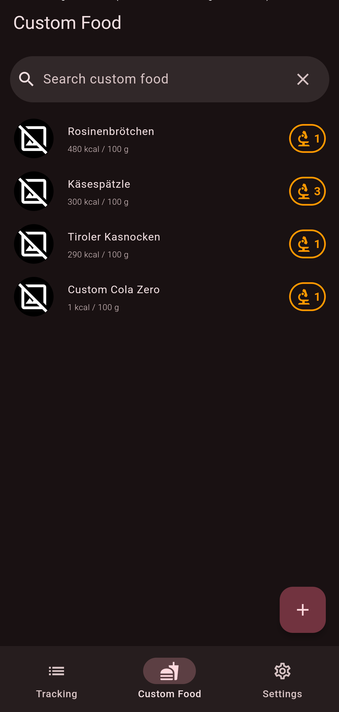

# Energize

[](https://hosted.weblate.org/engage/energize/) [](https://codeberg.org/teaserbot-labs/delightful-humane-design) [](https://f-droid.org/de/packages/com.flasskamp.energize/) [](https://codeberg.org/epinez/Energize/releases)

Track your food and nutrition easily and fast.

  - Energize is respecting the user's privacy. [🔒 Privacy policy](PRIVACY.md)
  - Community-moderated [[Matrix] room](https://matrix.to/#/%23energize:matrix.org)

<p align="center">
  <a href="https://epinez.codeberg.page/projects/energize/index.html"></a>
  <a href="https://f-droid.org/packages/com.flasskamp.energize"></a>
  <a href="https://play.google.com/store/apps/details?id=com.flasskamp.energize"></a>
</p>

<small>
Google Play is in closed beta at the moment. Feel free to drop me a message and include your Gmail address to participate. Google Play and Codeberg Pages may have outdated versions as there is no automation in place yet.
</small>

<br>

## Screenshots

<p align="center">
  
  
  
  
</p>

## Features

- Track your meals including calories, macro- and micronutrients
- Use several databases, including:
  - Open Food Facts
  - Swiss Food Composition Database
  - USDA FoodData Central
- Create custom meals
- Search meals by product name, barcode, or just scan the barcode
  - the barcode of the first matching custom food will be used or
  - Open Food Facts will be searched if that database is activated and no matching custom food was found
  - EAN, UPC, and custom barcodes for custom food are supported
- Get meal suggestions based on your last tracked meals
- Set targets for macro- and micronutrients including calculating them based on your personal details
- See your daily nutrition details
- Create an [encrypted backup](docs/backup-encryption/README.md) and restore it
  - Local and WebDAV backup are supported

## Build

This app is built with Flutter. You can get the current used SDK version under [submodules/flutter](submodules/flutter); this is also used to pin the correct Flutter dependency for automated F-Droid builds on new versions (tags).

1. Download and setup flutter: https://flutter.dev/docs/get-started/install
2. Clone repository: `git clone https://codeberg.org/epinez/Energize.git && cd Energize`
3. Install dependencies: `flutter pub get`
4. Run build runner to generate types: `dart run build_runner build --delete-conflicting-outputs`
5. Build and install: `flutter run`

## Test / Automated screenshots

The integration tests automatically create different screenshots using all supported locales with dark and light theme.

Run integration tests:

```
flutter drive --driver=test_driver/integration_test.dart --target=integration_test/app_test.dart
```

This saves the screenshots to:

```
fastlane/metadata/android/<locale>/images/phoneScreenshots/<number>_<theme>.png
```

## Contribute

Energize has already benefited incredibly from many contributors. It would be great if this could continue or even be expanded in the future.

You are very welcome to:

- Help translating via Weblate: [](https://hosted.weblate.org/engage/energize/)
- Create issues for
  - things not working as intended
  - feature requests

  Please have a look whether similar issues already exist in advance.
- Develop something
    - There is no written roadmap yet
      - [milestones](https://codeberg.org/epinez/Energize/milestones) are an indicator
      - Open issues could also be used as a reference
    - There are no code style guidelines in place, hopefully the [linter rules](https://codeberg.org/epinez/Energize/src/branch/main/analysis_options.yaml) can assist
    - Using [Conventional Commits](https://www.conventionalcommits.org) for PRs would be wonderful
    - it's easier to reach out in advance if you want something to be merged later 😊

## Donate

If you want to support the development by a donation, you are very welcome to do so. Creating this app is a lot of fun but also a very time consuming task. Your donation helps to fill my coffee pot and makes sure my protein bars are filled up.

[](https://liberapay.com/epinez/donate)

**BTC: 35DcbAwi66LDyvxfpmvxVrM7nYrrZVC59k**

## Documentation

If there are any further questions, may have a look at the [docs](docs/README.md).

---

© Christian Flaßkamp – energize@flasskamp.com
